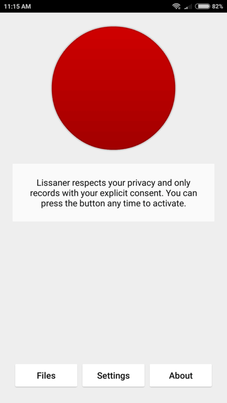

# Lissaner

An Android app that records your microphone in the background and keeps the
last 30 minutes in memory that you can save to a file whenever you want.

## Contributing

The easiest way to contribute is by starring this project on GitHub!

https://github.com/daniel-araujo/lissaner

If you've found a bug, would like to suggest a feature or need help, feel free
to open issues on GitHub:

https://github.com/daniel-araujo/lissaner/issues

## Legal

Copyright 2020 Daniel Araujo <contact@daniel-araujo.pt>

The source code is distributed under GNU Affero General Public License Version
3. See the LICENSE file for more details.
